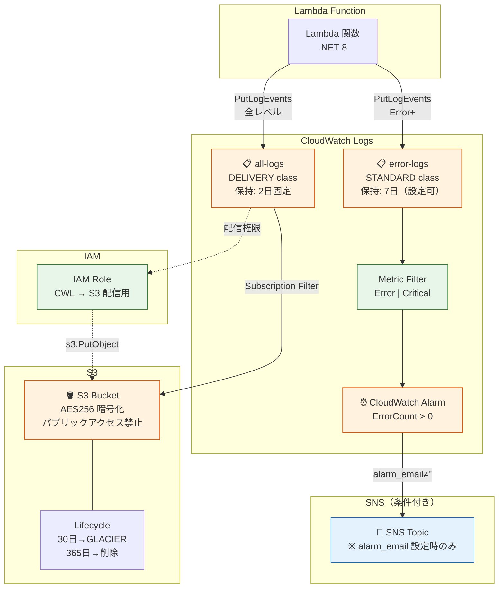

# DotnetLambdaLogBase

.NET 8 AWS Lambda 向けの ILogger ベース CloudWatch Logs カスタムプロバイダーテンプレートです。

ログを **2 つの CloudWatch Logs グループ** に自動振り分けし、全ログの長期保管とエラーログのリアルタイム監視を両立します。

## アーキテクチャ

```
Lambda Function
  │
  ├─ ILogger<T>  (Microsoft.Extensions.Logging)
  │
  ├─ CloudWatchLoggerProvider
  │     ├─ CloudWatchLogger (per category)
  │     └─ LogBuffer (ConcurrentQueue, thread-safe)
  │
  └─ FlushAsync()  ──┬──▶  all-logs グループ   [DELIVERY class]
                      │       → 全レベルのログ
                      │       → S3 へ自動配信（長期保管）
                      │
                      └──▶  error-logs グループ  [STANDARD class]
                              → Error 以上のログ
                              → Metric Filter + CloudWatch Alarm
```

### ログ振り分け

| ロググループ | Log Group Class | 保持期間 | 用途 |
|---|---|---|---|
| `/lambda/{app}/all-logs` | DELIVERY | 2 日（AWS 固定） | 全ログを S3 へ配信して長期保管 |
| `/lambda/shared/error-logs` | STANDARD | 7 日（設定可能） | Lambda 横断のエラー監視・アラーム連携 |

- **DELIVERY class**: 低コストで大量ログの配信に最適。GetLogEvents / FilterLogEvents は使用不可
- **STANDARD class**: Metric Filter・Subscription Filter・GetLogEvents に対応

### Terraform インフラ構成

以下の Mermaid 図は `terraform/` で構築される AWS リソースの全体像です。



> 💡 **凡例**: 🟠オレンジ = 課金対象、🟢緑 = 無料、🔵青 = 条件付き課金

### AWS 課金要素

| サービス | Terraform リソース | 課金モデル | 無料枠 | コスト目安 |
|---|---|---|---|---|
| **CloudWatch Logs（取り込み）** | `aws_cloudwatch_log_group.all_logs` / `error_logs` | 従量課金: $0.50/GB（取り込み） | 5GB/月（常に無料枠内） | ログ量に依存 |
| **CloudWatch Logs（保管）** | 同上 | 従量課金: $0.03/GB/月 | 5GB/月 | DELIVERY=2日固定、STANDARD=設定値 |
| **S3（ストレージ）** | `aws_s3_bucket.log_delivery` | 従量課金: ~$0.025/GB/月（S3 Standard） | 5GB/月（12ヶ月間） | 30日後 GLACIER ($0.004/GB) |
| **S3（PUT リクエスト）** | 同上 | $0.005/1,000リクエスト | 2,000リクエスト/月 | 配信頻度に依存 |
| **CloudWatch Alarm** | `aws_cloudwatch_metric_alarm.error_alarm` | 固定: $0.10/アラーム/月 | 10アラーム | $0.10/月 |
| **CloudWatch Metric Filter** | `aws_cloudwatch_log_metric_filter.error_count` | **無料** | — | $0 |
| **SNS（通知）** | `aws_sns_topic.alarm` | 従量: $0.50/100,000 通知（Email） | 1,000通知/月 | alarm_email 未設定時は $0 |
| **Subscription Filter** | `aws_cloudwatch_log_subscription_filter.s3_delivery` | **無料** | — | $0 |
| **IAM Role / Policy** | `aws_iam_role.cwl_to_s3` | **無料** | — | $0 |

> 💡 **コスト最適化のポイント**:
> - **DELIVERY class** を使用することで、CloudWatch Logs の保管コストを最小化（2日固定で自動削除）
> - S3 Lifecycle で **30日後に GLACIER** へ移行し、ストレージコストを約 85% 削減
> - SNS は `alarm_email` を設定しなければ作成されない（条件付きリソース）
> - 小〜中規模の Lambda であれば、**無料枠内で運用可能**

### ログストリーム命名規則

```
{yyyy/MM/dd}/{FunctionName}/{GUID}
```

例: `2026/02/15/MyFunction/a1b2c3d4e5f6`

## フォルダ構成

```
dotnet-lambda-log-base/
├── DotnetLambdaLogBase.sln                    # ソリューションファイル
├── README.md
│
├── src/
│   ├── DotnetLambdaLogBase/                   # Lambda 関数プロジェクト
│   │   ├── Function.cs                        #   ハンドラーテンプレート
│   │   ├── aws-lambda-tools-defaults.json     #   デプロイ設定
│   │   └── DotnetLambdaLogBase.csproj
│   │
│   └── DotnetLambdaLogBase.Logging/           # ログライブラリ
│       ├── CloudWatchLoggerProvider.cs        #   ILoggerProvider 実装
│       ├── CloudWatchLogger.cs                #   ILogger 実装
│       ├── CloudWatchLoggerOptions.cs         #   設定オプション
│       ├── CloudWatchLogSender.cs             #   PutLogEvents API 送信
│       ├── LogBuffer.cs                       #   スレッドセーフバッファ
│       ├── LogEntry.cs                        #   ログエントリモデル
│       ├── JsonLogFormatter.cs                #   JSON フォーマッター
│       ├── ILogFormatter.cs                   #   フォーマッターインターフェース
│       ├── ILogSender.cs                      #   送信インターフェース
│       └── LoggingServiceCollectionExtensions.cs  # DI 拡張メソッド
│
├── tests/
│   └── DotnetLambdaLogBase.Logging.Tests/     # xUnit テスト (28 テスト)
│       ├── JsonLogFormatterTests.cs
│       ├── LogBufferTests.cs
│       ├── CloudWatchLogSenderTests.cs
│       ├── CloudWatchLoggerTests.cs
│       ├── CloudWatchLoggerProviderTests.cs
│       └── SanityTests.cs
│
├── docs/
│   └── logging-library/                       # ログライブラリドキュメント
│       ├── requirements.md                    #   要件定義
│       ├── basic-design.md                    #   基本設計
│       └── detailed-design.md                 #   詳細設計
│
├── e2e/                                       # E2E テスト
│   ├── main.tf                                #   テスト用 Terraform
│   ├── run-e2e-tests.sh                       #   テスト実行スクリプト
│   └── test-report.md                         #   テスト結果レポート
│
└── terraform/                                 # インフラ定義
    ├── providers.tf                           #   AWS プロバイダー設定
    ├── variables.tf                           #   変数定義
    ├── cloudwatch.tf                          #   ロググループ・アラーム
    ├── s3.tf                                  #   ログ保管バケット
    ├── s3_delivery.tf                         #   CWL→S3 配信（IAM + Filter）
    ├── sns.tf                                 #   アラーム通知
    └── outputs.tf                             #   出力値
```

## 前提条件

- [.NET 8 SDK](https://dotnet.microsoft.com/download/dotnet/8.0)
- [AWS CLI](https://docs.aws.amazon.com/cli/latest/userguide/getting-started-install.html)（設定済み）
- [Amazon.Lambda.Tools](https://github.com/aws/aws-extensions-for-dotnet-cli)（Lambda デプロイ用）
- [Terraform](https://www.terraform.io/downloads) >= 1.0（インフラ構築用）

## セットアップ

### 1. ビルド

```bash
dotnet build
```

### 2. テスト

```bash
dotnet test
```

### 3. インフラ構築

```bash
cd terraform

terraform init
terraform plan -var="app_name=my-app"
terraform apply -var="app_name=my-app"
```

#### Terraform 変数

| 変数名 | 必須 | デフォルト | 説明 |
|---|---|---|---|
| `app_name` | ✅ | — | アプリケーション名（ロググループ名に使用） |
| `aws_region` | | `ap-northeast-1` | AWS リージョン |
| `error_log_retention_days` | | `7` | エラーロググループの保持日数 |
| `s3_bucket_prefix` | | `lambda-logs` | S3 バケット名のプレフィックス |
| `alarm_email` | | `""` | アラーム通知先メール（空の場合 SNS 未作成） |
| `tags` | | `{}` | 全リソースに付与するタグ |

### 4. Lambda デプロイ

```bash
cd src/DotnetLambdaLogBase

dotnet lambda deploy-function MyFunction \
  --function-role arn:aws:iam::123456789012:role/lambda-role \
  --environment-variables "ALL_LOGS_GROUP=/lambda/my-app/all-logs;ERROR_LOGS_GROUP=/lambda/shared/error-logs"
```

## 使用方法

### 基本的な使い方

`Function.cs` がテンプレートになっています。`FunctionHandler` メソッド内にビジネスロジックを実装してください。

```csharp
public async Task<string> FunctionHandler(object input, ILambdaContext context)
{
    try
    {
        _logger.LogInformation("Processing request: {RequestId}", context.AwsRequestId);

        // ビジネスロジックをここに実装
        var result = await ProcessAsync(input);

        _logger.LogInformation("Request completed: {RequestId}", context.AwsRequestId);
        return result;
    }
    catch (Exception ex)
    {
        _logger.LogError(ex, "Error processing request: {RequestId}", context.AwsRequestId);
        throw;
    }
    finally
    {
        // ログを確実に送信（ServiceProvider は Dispose しない）
        await _loggerProvider.FlushAsync();
    }
}
```

### オプション設定のカスタマイズ

コンストラクタで `CloudWatchLoggerOptions` を設定できます。

```csharp
_serviceProvider = new ServiceCollection()
    .AddLogging(builder => builder.AddCloudWatchLogger(o =>
    {
        o.AllLogsGroupName = "/lambda/my-app/all-logs";
        o.ErrorLogsGroupName = "/lambda/shared/error-logs";
        o.FunctionName = "MyFunction";
        o.MinimumLevel = LogLevel.Debug;          // 最小記録レベル
        o.ErrorGroupMinimumLevel = LogLevel.Warning; // エラーグループの閾値
        o.MaxBufferSize = 5000;                   // バッファ上限
    }))
    .BuildServiceProvider();
```

### 設定オプション一覧

| プロパティ | 型 | デフォルト | 説明 |
|---|---|---|---|
| `AllLogsGroupName` | `string` | `/lambda/app/all-logs` | 全ログ用ロググループ名 |
| `ErrorLogsGroupName` | `string` | `/lambda/shared/error-logs` | エラー用ロググループ名 |
| `FunctionName` | `string?` | `null` | ログストリーム命名に使用 |
| `MinimumLevel` | `LogLevel` | `Information` | 記録する最小ログレベル |
| `ErrorGroupMinimumLevel` | `LogLevel` | `Error` | エラーグループに送信する最小ログレベル |
| `MaxBufferSize` | `int` | `10000` | バッファの最大エントリ数（超過時は古いものを破棄） |

### 環境変数

Lambda の環境変数で動的に設定可能です。

| 環境変数 | 説明 |
|---|---|
| `ALL_LOGS_GROUP` | 全ログ用ロググループ名 |
| `ERROR_LOGS_GROUP` | エラー用ロググループ名 |
| `AWS_LAMBDA_FUNCTION_NAME` | 関数名（AWS が自動設定） |

## 設計上の注意点

### FlushAsync パターン

Lambda はコンテナを再利用するため、`ServiceProvider.DisposeAsync()` を呼ぶと **2 回目の呼び出しで ObjectDisposedException** が発生します。代わりに `FlushAsync()` でログを送信し、DI コンテナはそのまま保持します。

```csharp
// ✅ 正しい: FlushAsync でログを送信
finally
{
    await _loggerProvider.FlushAsync();
}

// ❌ 誤り: Dispose すると再利用時にエラー
finally
{
    await _serviceProvider.DisposeAsync();
}
```

### PutLogEvents API 制限

CloudWatch Logs の API 制限に自動対応しています。

| 制限 | 値 | 対応 |
|---|---|---|
| バッチサイズ | 最大 1 MB | 自動分割 |
| バッチイベント数 | 最大 10,000 件 | 自動分割 |
| 個別イベントサイズ | 最大 256 KB | UTF-8 安全な切り詰め |

### DELIVERY class の制約

- 保持期間は **2 日間固定**（変更不可）
- `GetLogEvents` / `FilterLogEvents` は使用不可
- Metric Filter / Subscription Filter は使用不可
- **S3 への自動配信** が主な用途

## E2E テスト結果

E2E テストは `e2e/` ディレクトリに含まれています。実際の AWS 環境に対して Terraform apply → Lambda デプロイ → テスト実行 → Terraform destroy を行います。

### 実行方法

```bash
cd e2e
./run-e2e-tests.sh
```

### テスト結果サマリー（2026-02-15 ap-northeast-1）

#### 機能要件テスト

| テストID | テスト名 | 結果 |
|----------|----------|------|
| F1 | Terraform apply 正常完了 | ✅ PASS |
| F2 | Lambda デプロイ＆正常実行 | ✅ PASS |
| F3 | all-logs ログストリーム作成 | ✅ PASS |
| F4 | error-logs ログストリーム作成 | ✅ PASS |
| F5 | JSON構造化ログ形式 | ✅ PASS |
| F6 | ログストリーム命名規則 | ✅ PASS |
| F7 | Metric Filter 動作確認 | ✅ PASS |
| F8 | 異常終了時のログFlush | ✅ PASS |

#### 非機能要件テスト

| テストID | テスト名 | 結果 |
|----------|----------|------|
| N1 | S3バケット暗号化（AES256） | ✅ PASS |
| N2 | S3パブリックアクセスブロック | ✅ PASS |
| N3 | S3ライフサイクル設定 | ✅ PASS |
| N4 | S3ログ配信パス確認 | ✅ PASS |
| N5 | Terraform destroy クリーンアップ | ✅ PASS |

**合計: PASS 13 / FAIL 0**

詳細は [`e2e/test-report.md`](e2e/test-report.md) を参照してください。

## ドキュメント

ログライブラリの詳細設計ドキュメントは [`docs/logging-library/`](docs/logging-library/) にあります。

| ドキュメント | 内容 |
|---|---|
| [要件定義](docs/logging-library/requirements.md) | 背景・課題・機能/非機能要件・受け入れ条件 |
| [基本設計](docs/logging-library/basic-design.md) | アーキテクチャ・コンポーネント構成・DI設計 |
| [詳細設計](docs/logging-library/detailed-design.md) | クラス設計・API リファレンス・処理フロー |

## ライセンス

MIT
