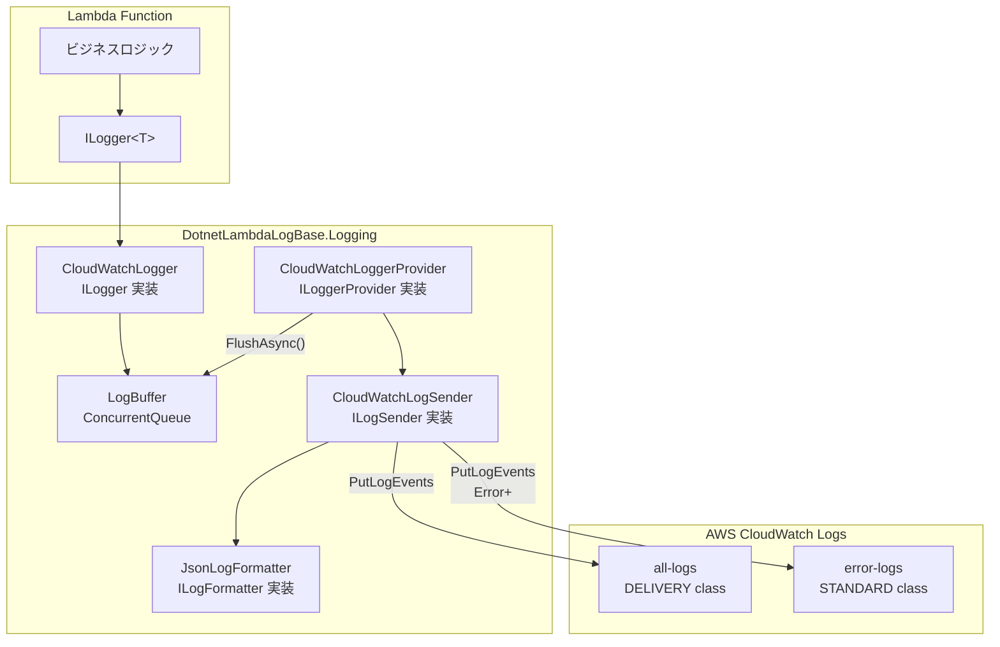
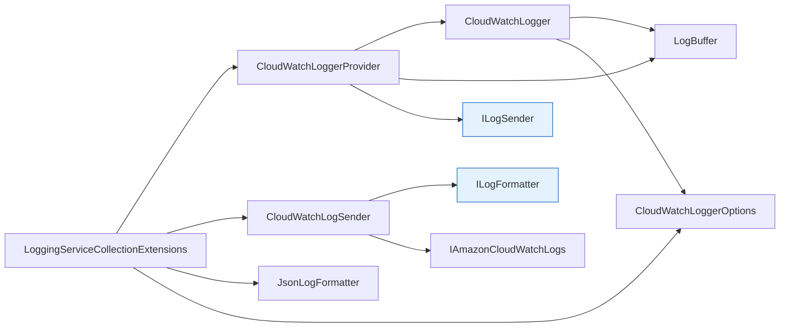
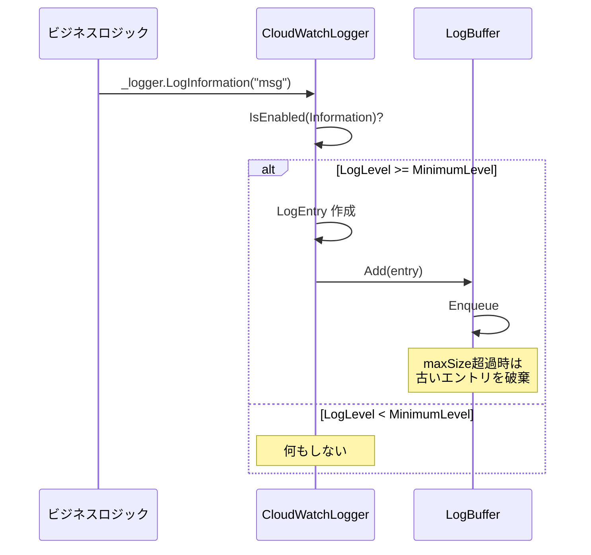
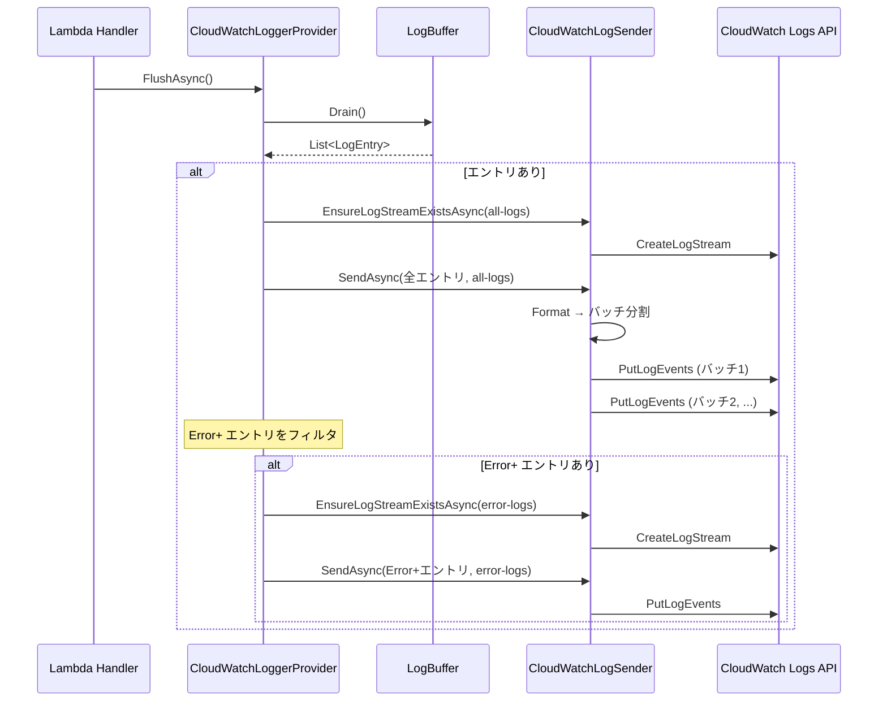
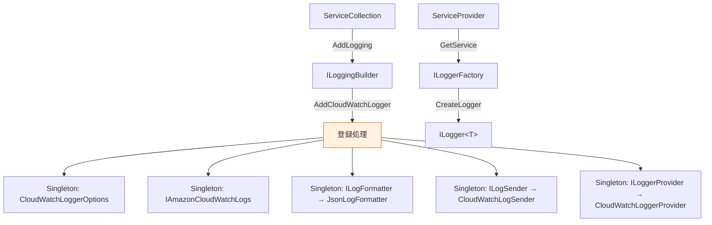

# ログライブラリ 基本設計

## 1. アーキテクチャ概要

### 1.1 全体構成



### 1.2 設計方針

| 方針 | 内容 | 理由 |
|---|---|---|
| **ILoggerProvider 準拠** | Microsoft.Extensions.Logging のインターフェースを実装 | 既存の .NET ログ基盤と自然に統合 |
| **バッファリング + 一括送信** | ログを ConcurrentQueue にバッファし、FlushAsync で一括送信 | API 呼び出し回数を最小化しコスト削減 |
| **例外 swallow** | ログ送信失敗時に例外を握りつぶす | ログ基盤の障害がビジネスロジックに影響しない |
| **FlushAsync パターン** | Dispose ではなく FlushAsync でログを送信 | Lambda コンテナの再利用に対応 |

## 2. コンポーネント構成

### 2.1 コンポーネント一覧

| コンポーネント | 責務 | インターフェース |
|---|---|---|
| `CloudWatchLoggerProvider` | Logger の生成・FlushAsync でバッファの一括送信を管理 | `ILoggerProvider`, `IAsyncDisposable` |
| `CloudWatchLogger` | ログエントリを作成しバッファに追加 | `ILogger` |
| `LogBuffer` | スレッドセーフなログエントリのバッファリング | （内部クラス） |
| `CloudWatchLogSender` | PutLogEvents API でログを送信、バッチ分割を処理 | `ILogSender` |
| `JsonLogFormatter` | LogEntry を JSON 文字列にフォーマット | `ILogFormatter` |
| `LogEntry` | ログエントリのデータモデル | （POCO） |
| `CloudWatchLoggerOptions` | 設定オプション（ロググループ名、レベル、バッファサイズ） | （POCO） |
| `LoggingServiceCollectionExtensions` | DI コンテナへの登録用拡張メソッド | （static class） |

### 2.2 依存関係



## 3. ログ振り分けフロー

### 3.1 書き込みフロー



### 3.2 送信フロー（FlushAsync）



## 4. DI 構成

### 4.1 登録パターン

```csharp
// Lambda コンストラクタでの使用例
_serviceProvider = new ServiceCollection()
    .AddLogging(builder => builder.AddCloudWatchLogger(options =>
    {
        options.AllLogsGroupName = allLogsGroup;
        options.ErrorLogsGroupName = errorLogsGroup;
        options.FunctionName = functionName;
    }))
    .BuildServiceProvider();
```

### 4.2 DI コンテナのライフサイクル



> **全コンポーネントが Singleton**: Lambda コンテナの再利用に対応するため、全サービスを Singleton で登録。`ServiceProvider` は Lambda のライフサイクル全体で保持し、`DisposeAsync()` は呼ばない。

## 5. テスト概要

### 5.1 単体テスト構成

28 個の xUnit テストで以下のコンポーネントを検証：

| テストクラス | テスト数 | 対象コンポーネント | 検証内容 |
|---|---|---|---|
| `CloudWatchLogSenderTests` | 5 | CloudWatchLogSender | API 呼び出し、空リスト、エラー時 swallow、ストリーム作成 |
| `CloudWatchLoggerTests` | 7 | CloudWatchLogger | バッファ追加、レベルフィルタ、例外詳細、カテゴリ設定 |
| `CloudWatchLoggerProviderTests` | 4 | CloudWatchLoggerProvider | Logger 生成、FlushAsync 振り分け、空バッファ |
| `LogBufferTests` | 6 | LogBuffer | 追加、排出、上限超過、クリア、並行アクセス |
| `JsonLogFormatterTests` | 5 | JsonLogFormatter | JSON 生成、例外、プロパティ、null、特殊文字 |
| `SanityTests` | 1 | プロジェクト全体 | ビルド確認 |

### 5.2 テストカバレッジ方針

- **モック使用**: `ILogSender` と `IAmazonCloudWatchLogs` をモック化し、AWS 依存なしでテスト
- **並行アクセステスト**: `LogBuffer` のスレッドセーフティを `Task.WhenAll` で検証
- **境界値テスト**: バッファサイズ上限、空リスト、null プロパティを網羅
