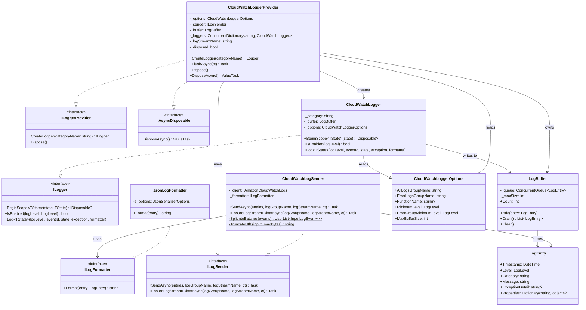
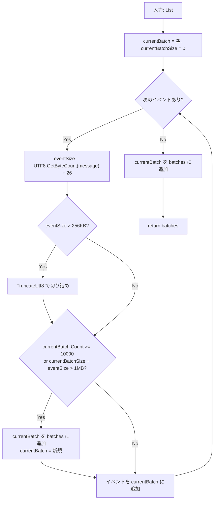

# ログライブラリ 詳細設計

## 1. クラス図



## 2. クラス別 API リファレンス

### 2.1 CloudWatchLoggerProvider

| メソッド | シグネチャ | 説明 |
|---|---|---|
| コンストラクタ | `(CloudWatchLoggerOptions options, ILogSender sender)` | オプションと送信者を受け取り、LogBuffer とログストリーム名を初期化 |
| `CreateLogger` | `ILogger CreateLogger(string categoryName)` | カテゴリ名ごとに CloudWatchLogger を生成（同名なら再利用） |
| `FlushAsync` | `Task FlushAsync(CancellationToken ct = default)` | バッファを排出し、all-logs と error-logs に送信 |
| `Dispose` | `void Dispose()` | disposed フラグを設定 |
| `DisposeAsync` | `ValueTask DisposeAsync()` | FlushAsync を呼んでから disposed フラグを設定 |

**ログストリーム名の生成規則:**

```
{yyyy/MM/dd}/{FunctionName ?? "unknown"}/{Guid:N}
```

### 2.2 CloudWatchLogger

| メソッド | シグネチャ | 説明 |
|---|---|---|
| コンストラクタ | `(string category, LogBuffer buffer, CloudWatchLoggerOptions options)` | カテゴリ・バッファ・オプションを保持 |
| `IsEnabled` | `bool IsEnabled(LogLevel logLevel)` | `logLevel >= MinimumLevel && logLevel != None` |
| `Log<TState>` | `void Log<TState>(...)` | LogEntry を作成し LogBuffer に追加 |
| `BeginScope` | `IDisposable? BeginScope<TState>(TState state)` | 常に `null` を返す（スコープ未対応） |

### 2.3 CloudWatchLogSender

| メソッド | シグネチャ | 説明 |
|---|---|---|
| コンストラクタ | `(IAmazonCloudWatchLogs client, ILogFormatter? formatter = null)` | AWS SDK クライアントとフォーマッタ（省略時 JsonLogFormatter） |
| `SendAsync` | `Task SendAsync(IReadOnlyList<LogEntry>, string, string, CancellationToken)` | ログを PutLogEvents で送信。例外は swallow |
| `EnsureLogStreamExistsAsync` | `Task EnsureLogStreamExistsAsync(string, string, CancellationToken)` | ログストリームを作成。既存なら無視 |
| `SplitIntoBatches` | `static List<List<InputLogEvent>> SplitIntoBatches(List<InputLogEvent>)` | API 制限に従いバッチ分割 |
| `TruncateUtf8` | `static string TruncateUtf8(string input, int maxBytes)` | UTF-8 境界を考慮した文字列切り詰め |

### 2.4 LogBuffer

| メソッド | シグネチャ | 説明 |
|---|---|---|
| コンストラクタ | `(int maxSize = 10000)` | 最大サイズを設定（0以下は `ArgumentOutOfRangeException`） |
| `Count` | `int Count { get; }` | 現在のバッファ内エントリ数 |
| `Add` | `void Add(LogEntry entry)` | エントリを追加。maxSize 超過時は古いものを破棄 |
| `Drain` | `List<LogEntry> Drain()` | 全エントリを取り出してバッファをクリア |
| `Clear` | `void Clear()` | バッファをクリア |

### 2.5 JsonLogFormatter

| メソッド | シグネチャ | 説明 |
|---|---|---|
| `Format` | `string Format(LogEntry entry)` | LogEntry を JSON 文字列にシリアライズ |

**JSON 出力形式:**

```json
{
  "timestamp": "2026-02-15T10:30:00.0000000Z",
  "level": "Information",
  "category": "MyApp.Services.OrderService",
  "message": "Order processed successfully",
  "exception": null,
  "properties": null
}
```

**シリアライズ設定:**
- `PropertyNamingPolicy`: camelCase
- `DefaultIgnoreCondition`: WhenWritingNull（null プロパティは出力しない）
- `WriteIndented`: false（1行 JSON）

### 2.6 LogEntry

| プロパティ | 型 | デフォルト | 説明 |
|---|---|---|---|
| `Timestamp` | `DateTime` | `DateTime.UtcNow` | ログのタイムスタンプ（UTC） |
| `Level` | `LogLevel` | — | ログレベル |
| `Category` | `string` | `""` | ロガーのカテゴリ名 |
| `Message` | `string` | `""` | フォーマット済みメッセージ |
| `ExceptionDetail` | `string?` | `null` | 例外の文字列表現 |
| `Properties` | `Dictionary<string, object>?` | `null` | 追加プロパティ |

### 2.7 CloudWatchLoggerOptions

| プロパティ | 型 | デフォルト | 説明 |
|---|---|---|---|
| `AllLogsGroupName` | `string` | `/lambda/app/all-logs` | 全ログ用グループ名 |
| `ErrorLogsGroupName` | `string` | `/lambda/shared/error-logs` | エラーログ用グループ名 |
| `FunctionName` | `string?` | `null` | ログストリーム命名に使用 |
| `MinimumLevel` | `LogLevel` | `Information` | 記録する最小ログレベル |
| `ErrorGroupMinimumLevel` | `LogLevel` | `Error` | エラーグループに送信する最小レベル |
| `MaxBufferSize` | `int` | `10000` | バッファの最大エントリ数 |

## 3. PutLogEvents バッチ分割ロジック

### 3.1 制限値

| 制限 | 値 | 定数名 |
|---|---|---|
| バッチあたり最大イベント数 | 10,000 | `maxBatchCount` |
| バッチあたり最大サイズ | 1,048,576 bytes (1MB) | `maxBatchBytes` |
| イベントあたり最大サイズ | 262,144 bytes (256KB) | `maxEventBytes` |
| イベントあたりオーバーヘッド | 26 bytes | `eventOverhead` |

### 3.2 分割アルゴリズム



### 3.3 UTF-8 切り詰め

256KB を超えるイベントは `TruncateUtf8` で安全に切り詰め：

1. UTF-8 バイト列に変換
2. `maxBytes` 位置から逆方向にスキャン
3. UTF-8 マルチバイト文字の途中（`0xC0` マスクが `0x80`）でないバイト境界を検出
4. その位置でデコードし `"... [TRUNCATED]"` を付加

## 4. エラーハンドリング

### 4.1 エラーハンドリング方針

| コンポーネント | エラー種別 | 対応 |
|---|---|---|
| `CloudWatchLogSender.SendAsync` | PutLogEvents 失敗 | `Console.Error.WriteLine` で出力、例外を swallow |
| `CloudWatchLogSender.EnsureLogStreamExistsAsync` | CreateLogStream 失敗 | `ResourceAlreadyExistsException` は無視、他は swallow |
| `CloudWatchLogger.Log` | バッファ追加 | 例外は発生しない（ConcurrentQueue は安全） |
| `LogBuffer.Add` | maxSize 超過 | 古いエントリを自動破棄（エラーなし） |

### 4.2 設計判断: 例外 swallow の理由

ログ基盤の障害がアプリケーションのビジネスロジックに影響することを防ぐため、ログ送信系の全例外を swallow する。ログ送信失敗は `Console.Error.WriteLine` で標準エラー出力に記録し、Lambda の標準 CloudWatch Logs（`/aws/lambda/{function-name}`）で確認可能。

## 5. 単体テスト詳細

### 5.1 CloudWatchLogSenderTests (5 テスト)

| No | テスト名 | 検証内容 | 期待結果 |
|---|---|---|---|
| UT-01 | `SendAsync_WithEntries_CallsPutLogEvents` | エントリありで PutLogEvents が呼ばれること | API 呼び出し 1 回 |
| UT-02 | `SendAsync_EmptyList_DoesNotCallApi` | 空リストで API が呼ばれないこと | API 呼び出し 0 回 |
| UT-03 | `SendAsync_ApiFailure_DoesNotThrow` | API 失敗時に例外が伝播しないこと | 例外なし |
| UT-04 | `EnsureLogStreamExistsAsync_CallsCreateLogStream` | ストリーム作成 API が呼ばれること | CreateLogStream 呼び出し |
| UT-05 | `EnsureLogStreamExistsAsync_AlreadyExists_DoesNotThrow` | 既存ストリームでエラーにならないこと | 例外なし |

### 5.2 CloudWatchLoggerTests (7 テスト)

| No | テスト名 | 検証内容 | 期待結果 |
|---|---|---|---|
| UT-06 | `Log_InformationLevel_AddsToBuffer` | Information レベルでバッファに追加されること | Buffer.Count == 1 |
| UT-07 | `Log_BelowMinimumLevel_DoesNotAddToBuffer` | MinimumLevel 未満でバッファに追加されないこと | Buffer.Count == 0 |
| UT-08 | `IsEnabled_AboveMinimum_ReturnsTrue` | MinimumLevel 以上で true を返すこと | true |
| UT-09 | `IsEnabled_BelowMinimum_ReturnsFalse` | MinimumLevel 未満で false を返すこと | false |
| UT-10 | `IsEnabled_None_ReturnsFalse` | LogLevel.None で false を返すこと | false |
| UT-11 | `Log_WithException_IncludesExceptionDetail` | 例外情報が ExceptionDetail に設定されること | ExceptionDetail != null |
| UT-12 | `Log_SetsCorrectCategory` | カテゴリ名が正しく設定されること | Category == 指定値 |

### 5.3 CloudWatchLoggerProviderTests (4 テスト)

| No | テスト名 | 検証内容 | 期待結果 |
|---|---|---|---|
| UT-13 | `CreateLogger_ReturnsSameInstanceForSameCategory` | 同一カテゴリで同じインスタンスを返すこと | ReferenceEquals == true |
| UT-14 | `FlushAsync_SendsAllLogsToAllLogsGroup` | FlushAsync で全ログが all-logs に送信されること | SendAsync(all-logs) 呼び出し |
| UT-15 | `FlushAsync_ErrorLogs_SentToBothGroups` | Error ログが両グループに送信されること | SendAsync 2 回呼び出し |
| UT-16 | `FlushAsync_EmptyBuffer_DoesNotCallSender` | 空バッファで送信が呼ばれないこと | SendAsync 呼び出しなし |

### 5.4 LogBufferTests (6 テスト)

| No | テスト名 | 検証内容 | 期待結果 |
|---|---|---|---|
| UT-17 | `Add_SingleEntry_CountIsOne` | 1 件追加で Count が 1 になること | Count == 1 |
| UT-18 | `Drain_ReturnsAllEntries_AndClearsBuffer` | Drain で全エントリ返却＆クリアされること | entries.Count > 0, Count == 0 |
| UT-19 | `Add_ExceedsMaxSize_DiscardsOldest` | maxSize 超過で古いエントリが破棄されること | Count == maxSize |
| UT-20 | `Drain_EmptyBuffer_ReturnsEmptyList` | 空バッファで空リストが返ること | entries.Count == 0 |
| UT-21 | `Clear_RemovesAllEntries` | Clear で全エントリが削除されること | Count == 0 |
| UT-22 | `Add_ConcurrentAccess_NoDataCorruption` | 並行アクセスでデータ破損がないこと | 例外なし, Count 整合 |

### 5.5 JsonLogFormatterTests (5 テスト)

| No | テスト名 | 検証内容 | 期待結果 |
|---|---|---|---|
| UT-23 | `Format_BasicEntry_ReturnsValidJson` | 基本エントリが有効な JSON になること | JSON パース成功 |
| UT-24 | `Format_WithException_IncludesExceptionDetail` | 例外付きで exception フィールドが含まれること | exception != null |
| UT-25 | `Format_WithProperties_SerializesProperties` | プロパティが JSON にシリアライズされること | properties フィールドあり |
| UT-26 | `Format_NullProperties_OmitsPropertiesField` | null プロパティで properties フィールドが省略されること | properties なし |
| UT-27 | `Format_SpecialCharacters_ProducesValidJson` | 特殊文字を含んでも有効な JSON になること | JSON パース成功 |

### 5.6 SanityTests (1 テスト)

| No | テスト名 | 検証内容 | 期待結果 |
|---|---|---|---|
| UT-28 | `Project_ShouldBuild` | プロジェクトが正常にビルドできること | ビルド成功 |

### 5.7 テスト結果サマリー

**単体テスト合計: 28 テスト — 全 PASS**
